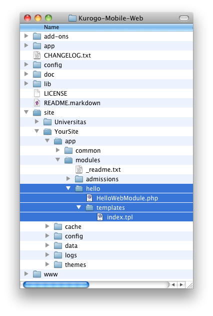
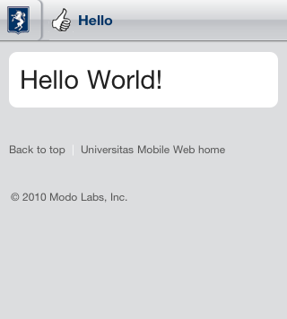

######################################
Making Your First Module - Hello World
######################################

This section will give you an overview of the module creation process. It is meant to be followed 
along, but most of the in-depth technical knowledge can be found in :doc:`modulenew`. Most of the 
content in this section is elaborated in more depth elsewhere.

================
Case Sensitivity
================

It is important to be mindful of case sensitivity issues. Many developers use file systems that are 
not case sensitive. Most servers (especially Linux based servers), do use case sensitive file systems 
so it is critical that when defining folder locations and urls that map to files or folders,
that the case used is consistent. Typically that means using lower case for urls.

====================================
Creating the module folder structure
====================================

*Note*: Please make sure you have followed the :doc:`installation steps <setup>` and have created
a site folder. *SITE_DIR* refers to *site/YOURSITE* where YOURSITE is the name of the site folder
you have created. 

The Kurogo Framework looks in a variety of locations for module data (see :doc:`tour`). You should
create your modules in your site's *app/modules* folder. Do **not** place new modules in the root
/app/modules folder as these are reserved for included Kurogo modules.

* Create a folder named *hello* inside *SITE_DIR/app/modules*
* Inside the *SITE_DIR/app/modules/hello* folder, create a folder named *templates*

==============================
Creating the module class file
==============================
   
Inside the *hello* directory create a file named *HelloWebModule.php* that contains the following contents::

    <?php
    
    class HelloWebModule extends WebModule
    {
      protected $id='hello';
      protected function initializeForPage() {
        $this->assign('message', 'Hello World!');
      }
    }

==========================
Creating the template file
==========================

Inside the *hello/templates* directory create a file named *index.tpl* that contains the following contents:

.. code-block:: html

      {include file="findInclude:common/templates/header.tpl"}
    
      <h1 class="focal">{$message}</h1>
    
      {include file="findInclude:common/templates/footer.tpl"}

Your folder structure should look similar to this:

==========================
Creating the nav bar image
==========================

Create a 56 x 56 PNG file named *title-hello.png* and place it in *SITE_FOLDER/themes/default/common/images/compliant*.

==========================
Creating the config folder
==========================

A configuration folder is required to load the module.

* Create a folder named *hello* in *SITE_FOLDER/config*
* Create a file named *SITE_FOLDER/config/hello/module.ini* with the following contents:

.. code-block:: ini

  [module]
  title="Hello"
  disabled = 0
  protected = 0
  search = 0
  secure = 0

==================
Viewing the module
==================

At this time you should be able to view your new module in your web browser. Assuming your site is on port 8888
on your local machine go to :kbd:`http://localhost:8888/hello`. If successful you should see your new module:

Congratulations! You've just built a simple module.

