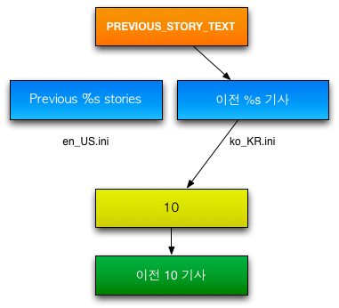

############
Localization
############

Kurogo has the ability so support different languages and localities. This includes the translation
of fixed on-screen values, error messages and other text strings. Currently Kurogo only includes
translations for US English, however users can create their own translations and include them 
in their own site or submit it to Kurogo for inclusion in future versions.

==========================
Configuration of Languages
==========================

A site can be configured to use a series of languages. When retrieving the proper value, Kurogo
will search the string tables in order and return the first match. This means that is not
necessary for language string tables to include a translation of every value.

The language order is set in the *[site settings]* section of *SITE_DIR/config/site.ini*. 
Simply create a series of LANGUAGES[] values in the order of precedence. Kurogo uses ISO country 
and locality codes for setting language settings. See :doc:`list of valid language codes <languages>` for 
language codes supported by Kurogo. For example:

.. code-block:: ini

    LANGUAGES[] = "es_ES"
    LANGUAGES[] = "ko_KR"
    LANGUAGES[] = "en_US"

Would use Spanish, followed by Korean followed by English. Note that it is not necessary to include
US English as it is always included at the end of not specified. Language order is specified by
the server, and cannot be influenced by the user. If you wish to host a site with different 
languages, than you can create a duplicate site with different language settings and host 
them with :doc:`multisite`. Then you could provide a link that directs the user to the alternative site
with a different language.

*Note:* If you use the admin console, you can only set the primary language, the admin console
does not support setting multiple languages. US English is always included last to ensure
that a valid value is retrieved. 

===================
Using String Tables
===================

There are string tables for the Kurogo core as well as for each module. Each file is located in
a *strings* folder and is named for the language/locality it represents. Kurogo will merge 
site string tables with include string tables so it is always possible to override values 
included with the project.

Locations include (examples given for US English String tables)

* app/common/strings/en_US.ini
* app/modules/home/strings/en_US.ini
* app/modules/news/stirngs/en_US.ini
* SITE_DIR/app/common/strings/en_US.ini (if you want to override Kurogo string values)
* SITE_DIR/app/modules/home/strings/en_US.ini (if you want to override the home module string values)
* SITE_DIR/app/modules/news/strings/en_US.ini (if you want to override the news module string values)

As with all Kurogo customizations, it is recommended that you create and edit files in your 
site folder rather than edit the project files to ensure smooth updates. 

If you wanted to create a Spanish (es_ES) version you could create

* SITE_DIR/app/common/strings/es_ES.ini 
* SITE_DIR/app/modules/home/strings/es_ES.ini 
* SITE_DIR/app/modules/news/strings/es_ES.ini 

------
Values
------

Each string table is a series of keys and values in .ini file format. To update the strings
simply replace the value. You do NOT need to include all keys in your file. If you only have
a few keys to update, you should simply include those keys in your file.

The names of the keys have been written to permit easy searching to locate where they are used

------------------
Format Specifiers
------------------

Some values include the replacement of a variable value into the string. Because languages
contain different grammar, it is necessary to include a placeholder for this value so it can
be properly placed within the sentence it is contained in. An example of this would be:

.. code-block:: ini

  SEARCH_MODULE="Search %s" ; english
  SEARCH_MODULE="%s 검색" ; korean

the %s would be replaced with the module name.

-----------
Site Values
-----------

Many of the values used by your site are actually standard configuration values
and are part of your site. These include things like:

* Site name and organization
* Names of modules and page titles
* Home screen icons
* About text
* Feeds (you may wish to choose feeds that contain content in the appropriate language)

Please see the appropriate :doc:`module <moduleslist>` or :doc:`configuration <configuration>` documentation for 
details about setting these values.

=======
Summary
=======

#. String key in template or module
#. Kurogo chooses the appropriate string table
#. If there is a value, it replaces any %s
#. Display string

