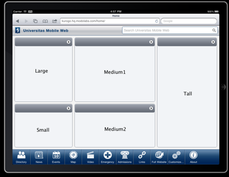

###########
Home Module
###########

The home module represents the main portal to your application. It provides a unified list of modules
available to users. It can be configured to show the list in a variety of styles.

The *SITE_DIR/config/home/module.ini* file contains the standard module configuration, but also has
several other keys for controlling the configuration of the home screen.

================
Home Screen Type
================

.. code-block:: ini

  display_type = "springboard" 

The display type property is a value that controls whether the home screen displays like a grid of 
icons ("springboard") or a list of items ("list"). 

=====================
Module list and order
=====================

There are 2 sections *[primary_modules]* and *[secondary_modules]* that indicate which modules are
shown on the home screen.

Each section has a list of values that represent the order of the modules and their titles. The order
of these values affects the order of the modules. Each value is the format:

.. code-block:: ini

    moduleID = "Label"
    
Primary modules can be rearranged and hidden by the user using the *Customize* module, secondary modules
appear smaller, but cannot be rearranged or removed by the user. Keep in mind that even if the entry is
not on the home screen, users can still manually navigate to the url. So if you have a modules that you
do not wish to use, ensure they have been *disabled* in their module configuration file.

=============
Configuration
=============

The following configuration values are available to customize the behaviour of the home module.

* *SHOW_LOGIN* - (optional) If set to true and :doc:`authentication` is enabled, a link allowing users to login will
  be displayed. Defaults to true.
* *HIDE_IMAGES* - (optional) Set to true to disable icons when homepage *display_type* is "list". Defaults to false.
* *SHOW_FEDERATED_SEARCH* - (optional) Enables/disables showing of the federated search bar on the homepage.
  Defaults to true.

===================
Banner Alert System
===================

Introduced in version 1.4, you can display small notifications on the home screen from other
modules. This allows users to know about information without visiting the module. An example
of this (and the only included module to support this behavior) is the Emergency Module. 
Developers can enable their modules to support this behavior by implementing only a few methods.

-------------
Configuration
-------------

By default the notification is disabled. The following options in the *[notice]* section of
the home module's *module.ini* file can be updated to enable notifications.

* *BANNER_ALERT*  - Set to 1 to enable notifications
* *BANNER_ALERT_MODULE*  - Set this to the module that will provide notifications. The module must conform to the *HomeAlertInterface*
  object interface
* *BANNER_ALERT_MODULE_LINK* - If set to 1, then the user can tap this notification and it will direct them to the module.

------------------------------
Creating a Notification Module
------------------------------

A module you set using *BANNER_ALERT_MODULE* must conform to the *HomeAlertInterface* interface.
In version 1.4 of Kurogo, only the Emergency module supports this behavior. This interface requires
the creation of 1 method in your module:

* public function getHomeScreenAlert() - This method should return a dictionary (array) with the
  following keys:
  * *title* - A title for the notification
  * *text* - The text of the notification
  * *date* - A formatted date string of the notification. Usually the post date of the Notification
  * *unixtime* - A unix timestamp of the post date of the notification.
  
If you module implements this interface (and implements the methods) you can use it to 
provide notifications to your users. 

=====
Icons
=====

For compliant browsers, you will need to create icons for each module. These icons should be placed
in: *SITE_DIR/themes/[ACTIVE_THEME]/modules/home/images/PAGETYPE*. Each module should have an 72x72 PNG file 
(for compliant and tablet) or 44x44 GIF file (for touch) named the same as its module id (about.png, news.gif, etc.)

================
Tablet Interface
================

Kurogo includes a special layout for tablet devices. 
The interface includes 2 significant changes from the standard layout. First there is a navigation strip that
appears at the bottom of the screen on all pages. This allows easy navigation to any module. in order 
to support this you will have to include an additional home screen icon for each module with a *-selected*
suffix (links-selected.png, calendar-selected.png, etc). 

Also, the home screen itself supports showing a reduced set of content on the home screen from a series
of modules in *panes*. Currently the layout of the home screen is fixed with 5 different panes. You
can choose which module will show up in which pane. 

You simply set which modules will appear in which pane by editing the *[tablet_panes]* section of 
*SITE_DIR/config/home/module.ini*. You would enter the moduleID for the item you want to show in a 
particular pane:

.. code-block:: ini

    [tablet_panes]
    large = "news"
    small = "about"
    medium1 = "video"
    medium2 = "emergency"
    tall = "calendar"

If you do not want to show the tablet interface you can change *TABLET_ENABLED* to 0 in *SITE_DIR/config/site.ini*.
When the tablet interface has been disabled, tablet devices will receive the *compliant* page type.

===============================
Dynamic Home Screen Information
===============================

In some scenarios it may be necessary to have the information show on the home screen (or tablet nav bar)
to be more dynamic. This would permit custom titles or subtitles, images, and even display based on any 
conditions that are appropriate. In order to utilize this please read the section on :ref:`Dynamic Home Screen Information 
<dynamic_nav_data>`. 
