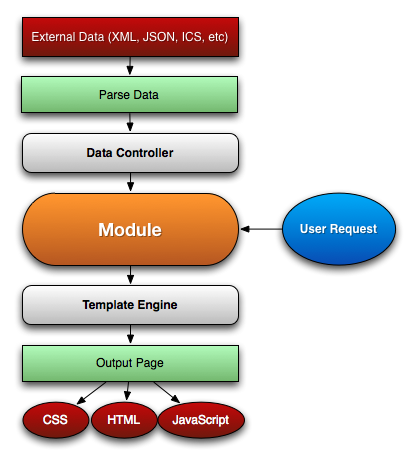

#################
Overview
#################

Kurogo is a PHP framework for delivering high quality, data driven customizable content to a wide 
range of mobile devices. Its strengths lie in the customizable system that allows you to adapt 
content from a variety of sources, and easily present that to a range of mobile devices from feature phones, 
early generation smart phones, to modern devices and tablets. The mobile web component exists 
as a web based application served using PHP. This application is hosted on a web server and users 
access it using the web browser on their mobile device.
 
It is available under a liberal open source MIT license. This means you are free to download, install,
copy, modify and use the software as you see fit. 

=======
Modules
=======

The building block for Kurogo is modules. Each page request is handled by a module that parses the
url and displays one of its *pages* with content.  Modules are contained pieces of code that (typically)
connect to external services, process the data and display it on the device using standard HTML and
CSS. Kurogo is designed to accept data from a variety of external sources, parse and process that data
and prepare it in a format suitable for presentation. 

A typical user request would include querying a data source and parsing the resulting data using
a :doc:`Data Parser <dataparser>`. Then the module would pass the data to the *Template Engine* which outputs the
page using appropriate HTML, CSS and Javascript for the device.

================
Device Detection
================

An important feature of Kurogo is the ability to detect the device being used. Because mobile devices
have different capabilities and performance characteristics, classifying devices is critical to 
giving the user the best experience possible while still supporting a wide variety of devices. 

Kurogo classifies devices by *pagetype* and *platform*. The pagetype is a generic classification that
outlines the device's basic capabilities: its level of CSS support, javascript, image handling, etc.
The platform is the specific operating system/browser used. Each of these values can be used to 
provide a customized experience for devices. Kurogo already has a series of templates and css
files that provides this experience for the included modules and common user interface elements.

=============
Customization
=============

From the beginning, Kurogo is built to be customized. You have full control of how data gets into a 
module, how it is parsed, and how it gets presented to the user. The modular nature of the software
allows you to customize its behavior at any step of the process. 

------------------
Data Customization
------------------

Each module gives you the opportunity to choose the data source and processing methods for getting
data into your application. By abstracting the details of retrieving and parsing data, your application
can respond to a variety of data sources. Most modules will use a subclass of :doc:`DataModel <datamodel>`. 
Each model uses an object called a :doc:`Data Retriever <dataretriever>` to retrieve the data
and then parse it using a :doc:`DataParser <dataparser>` object that takes the resulting data and
creates an appropriate PHP structure. Through configuration you can customize which DataRetriever and
DataParser are used in a request which can influence the structures that get used. You can also create
your own Data Retrievers and Data Parsers to handle the unique qualities of your site's data.

------------------
Code Customization
------------------

Each module is a PHP object that inherits from the *WebModule* class. Developers can create their own
modules or just subclass existing ones. When extending, you can choose only to override certain methods.
This allows you to concentrate on the features and behaviors that make your module unique.

--------------------
Output Customization
--------------------

Once the data has been prepared for output, you have several means to customize the presentation. Each
page is associated with a HTML document. These templates can be customized and overridden as needed
and there is a library of existing fragments that contain common user interface elements and pieces,
each customized for the appropriate device. Along with HTML, you can also customize the style sheets
associated with the page using the cascading nature of CSS. 