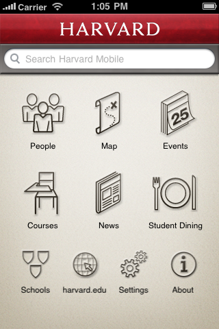
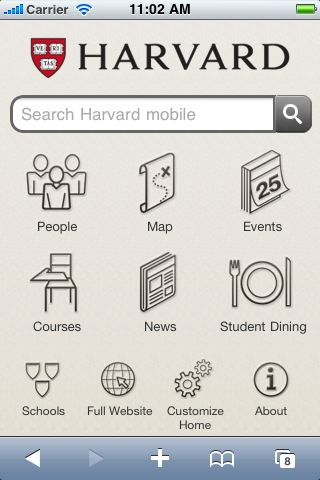
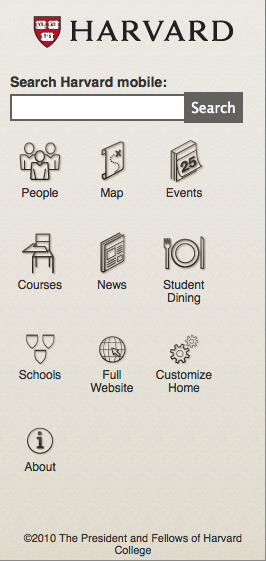
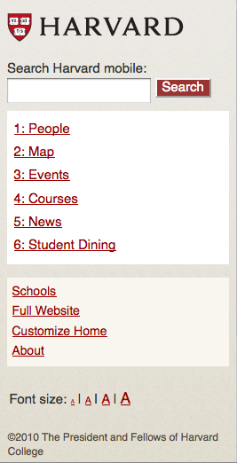

.. _modules_home:

**************
Home Screen
**************

On the iPhone native app, the home screen shows a grid of large and
small icons below a search bar.  Large icons link to standard modules
and small icons link to utility modules.

Mobile devices with Webkit browsers are shown a home screen very
similar to the iPhone native app home screen.  Generic touchscreen
devices are shown the search bar and icon grid with slightly simpler
styling, and basic mobile devices are shown a linear list of module
links below the search bar.

==================
Federated Search
==================

The search bar on the top of each home screen executes a "federated
search" which dispatches the same search term to all modules that have
a search function.  Search results are presented in sections separated
by module title.

The set of searchable modules currently includes:

* People Directory
* Map
* Events
* Courses
* News

