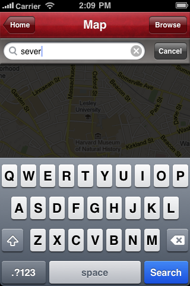
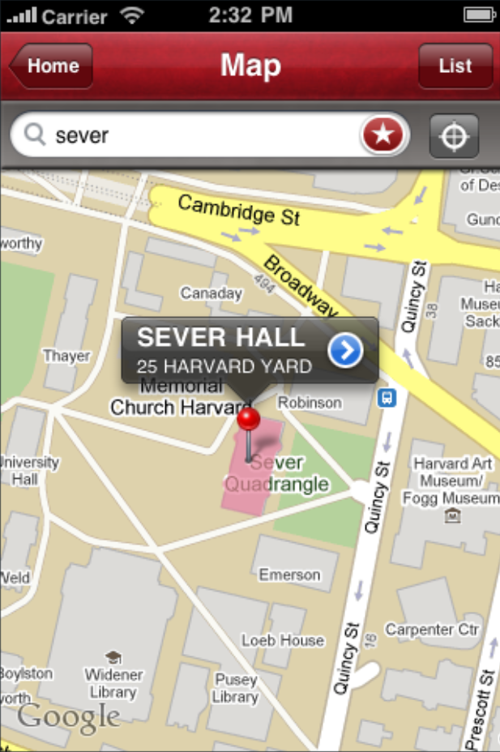
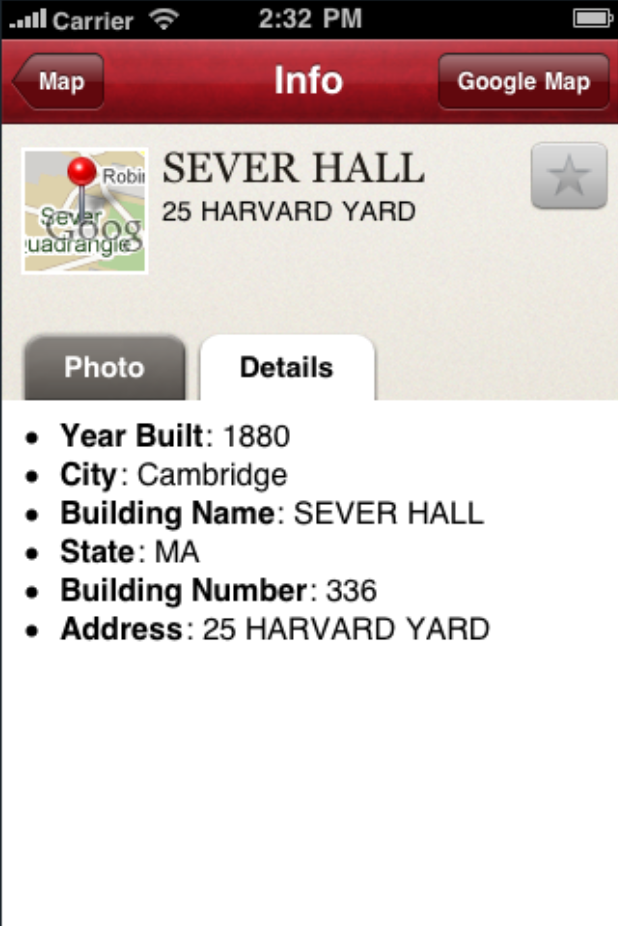
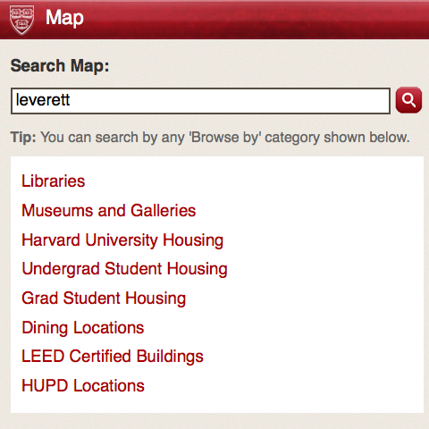
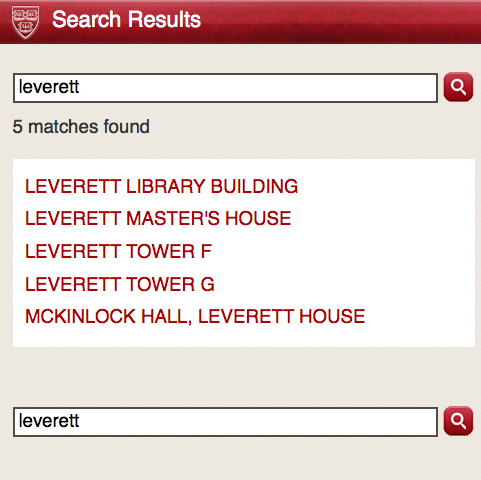
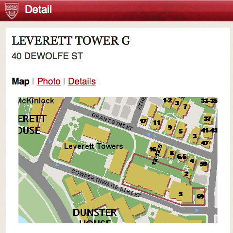
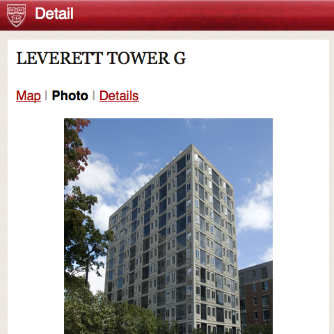
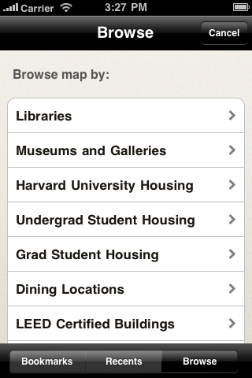
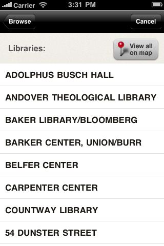

.. _modules_map:

*****************
Map
*****************

The Map module provides an interface to the Harvard Campus Map.  It provides the following functionality:

* Search for a location on campus by name
* Browser for a location by category
* View available details about a location, including a map view, photo image, and other metadata.
* Shortcuts from other modules to a map search (e.g. office address in People Directory, meeting location in Courses)
* On iPhone native app only, bookmark selected locations.

====================
Map Views
====================

---------
iPhone
---------

The iPhone app uses MapKit, which fetches and renders map tiles from
Google Maps.  The initial extent of the map comes from
http://upo-srv2.cadm.harvard.edu/ArcGIS/rest/services/CampusMap/MapServer?f=json
which is executed the first time the map module is loaded.  All
projection and extent information is permanently cached within the
application on the device.

Conversion between projected coordinates and lat/lon coordinates is
done through the proj.4 library.  The projection string required to
create a proj.4 projPJ object is fetched as follows:

iPhone requests

http://m.harvard.edu/api/?module=map&command=proj4specs&wkid=2249

Our server (if properties are not already cached) requests

http://spatialreference.org/ref/epsg/2249/proj4/

and wraps the response into the JSON string

.. code-block:: javascript

  { "properties" : "+proj=lcc +lat_1=42.68333333333333 +lat_2=41.71666666666667 +lat_0=41 +lon_0=-71.5 +x_0=200000.0001016002 +y_0=750000 +ellps=GRS80 +datum=NAD83 +to_meter=0.3048006096012192 +no_defs " }

-------------------
Mobile Web
-------------------

Map images on the mobile web use the WMS server at
http://upo-srv2.cadm.harvard.edu/ArcGIS/rest/services/CampusMapWithText/MapServer

Our server fetches WMS capabilities data (from
http://upo-srv2.cadm.harvard.edu/ArcGIS/services/CampusMapWithText/MapServer/WMSServer?request=GetCapabilities&service=WMS
) and caches it for a minimum of 7 days.

================
Search
================

General searches -- searches on all platforms, using the search bar on
either the main home screen or the Map module home screen -- are first
passed to the API at map.harvard.edu.  The results contain building
numbers, which correspond to building numbers returned by the ArcGIS
``CampusMap`` service.

Given a result set with building numbers, each individual building's
details including geometries, if not already cached on our server, are
fetched via the ``find`` API from the ``CampusMap`` `service
<http://upo-srv2.cadm.harvard.edu/ArcGIS/rest/services/CampusMap/MapServer>`_.

Individual building details are cached for a minimum of 30 days.  All
building details are de-duped and aggregated before returning to the
calling interface (mobile web or iPhone app).

--------------------------------
Example iPhone search sequence
--------------------------------

User types "sever"

iPhone requests
http://m.harvard.edu/api/?q=sever&module=map&command=search

Our server requests
http://map.harvard.edu/mapserver/campusmap_search.cfm?str=sever&fmt=json

map.harvard.edu responds

.. code-block:: javascript

  { "results" :
    [
      { "feature_type" : "Departments, Centers, Institutes",
        "bld_num" : "336",
        "bld_root" : "04425",
        "search_string" : "sever",
        "match_string" : "Film Study Center (Sever Hall)",
        "lat" : "42.37437", "lon" : "-71.115491",
        "sp_x": "760065.319",
        "sp_y" : "2961680.904"
      } , {
        "feature_type" : "Harvard Buildings",
        "bld_num" : "336",
        "bld_root" : "04425",
        "search_string" : "sever",
        "match_string" : "Sever Hall",
        "lat" : "42.37437",
        "lon" : "-71.115491",
        "sp_x": "760065.319",
        "sp_y" : "2961680.904"
      } , {
        "feature_type" : "Harvard Libraries",
        "bld_num" : "336",
        "bld_root" : "04425",
        "search_string" : "sever",
        "match_string" : "Grossman Library (Sever Hall)",
        "lat" : "42.37437",
        "lon" : "-71.115491",
        "sp_x": "760065.319",
        "sp_y" : "2961680.904"
      }
    ]
  }

The above result set results in the array of building numbers,

.. code-block:: javascript

  [ "336" ]

Based on this array, our server checks for cached information about
this building.  If not present, it requests (a URL encoded version of)::

  http://upo-srv2.cadm.harvard.edu/ArcGIS/rest/services/CampusMap/MapServer/find
    ?searchText=336
    &searchFields=Building Number
    &contains=false
    &sr=
    &layers=0
    &returnGeometry=true
    &f=json

ArcGIS server responds

.. code-block:: javascript

  {
    "results" : [
      {
        "layerId" : 0, 
        "layerName" : "Harvard Buildings", 
        "displayFieldName" : "Building_HU.Primary_Building_Name", 
        "foundFieldName" : "Building Number", 
        "value" : "336", 
        "attributes" : {
          "OBJECTID" : "124", 
          "Shape" : "Polygon", 
          "Building Number" : "336", 
          "Building Name" : "SEVER HALL", 
          "Address" : "25 HARVARD YARD", 
          "City" : "Cambridge", 
          "State" : "MA", 
          "Root" : "04425", 
          "Year Built" : "1880", 
          "PHOTO_FILE" : "04425 SEVER HALL E elev 121505.png"
        }, 
        "geometryType" : "esriGeometryPolygon", 
        "geometry" : 
        {
          "spatialReference" : {
            "wkid" : 2249
          }, 
          "rings" : 
          [
            [
              [760110.327800666, 2961705.35210892], 
              [760106.092572813, 2961686.98108264], 

              ...

              [760116.612564898, 2961708.10899316], 
              [760110.327800666, 2961705.35210892]
            ]
          ]
        }
      }
    ]
  }

Our server wraps all responses above into an array, returning the
following JSON response to the iPhone:

.. code-block:: javascript

  { "results" :
    [
      { "layerId" : 0,
        "layerName" : "Harvard Buildings",

        ...
      }
    ]
  }

iPhone locates the building geometries and populates building details.

----------------------------------------
Example Mobile Web search sequence
----------------------------------------

From http://m.harvard.edu/map, user types "leverett"

Our server requests
http://map.harvard.edu/mapserver/campusmap_search.cfm?str=leverett&fmt=json

map.harvard.edu returns

.. code-block:: javascript

  { "results" :
    [
      { "feature_type" : "Harvard Buildings",
        "bld_num" : "940C",
        "bld_root" : "03281",
        "search_string" : "leverett",
        "match_string" : "Leverett Library",
        "lat" : "42.369402",
        "lon" : "-71.116812",
        "sp_x": "759716.617",
        "sp_y" : "2959868.783"
      } , {
        "feature_type" : "Harvard Buildings",
        "bld_num" : "940D",
        "bld_root" : "03282",
        "search_string" : "leverett",
        "match_string" : "Leverett Master's House",
        "lat" : "42.36984",
        "lon" : "-71.117058",
        "sp_x": "759649.36",
        "sp_y" : "2960028.112"
      } , {
        "feature_type" : "Harvard Buildings",
        "bld_num" : "940A",
        "bld_root" : "03283",
        "search_string" : "leverett",
        "match_string" : "Leverett Tower F",
        "lat" : "42.369296",
        "lon" : "-71.116058",
        "sp_x": "759831.4",
        "sp_y" : "2959938.983"
      } , {
        "feature_type" : "Harvard Buildings",
        "bld_num" : "03285",
        "bld_root" : "03285",
        "search_string" : "leverett",
        "match_string" : "Leverett Tower G",
        "lat" : "",
        "lon" : "",
        "sp_x": "759920.517",
        "sp_y" : "2959831.083"
      } , {
        "feature_type" : "Harvard Residential Houses",
        "bld_num" : "",
        "bld_root" : "",
        "search_string" : "leverett",
        "match_string" : "Leverett House",
        "lat" : "42.369286",
        "lon" : "-71.116385",
        "sp_x": "759877",
        "sp_y" : "2959947"
      } , {
        "feature_type" : "Harvard Rooms and Auditoriums",
        "bld_num" : "940B",
        "bld_root" : "03284",
        "search_string" : "leverett",
        "match_string" : "Leverett Old Library (McKinlock Hall)",
        "lat" : "42.369956",
        "lon" : "-71.117486",
        "sp_x": "759533.7",
        "sp_y" : "2960069.856"
      }
    ]
  }

This results in the set of building numbers

.. code-block:: javascript

  [ "940C", "940D", "940A", "03285", "940B" ]

Based on which our server makes up to five requests (if not cached) of the form::

  http://upo-srv2.cadm.harvard.edu/ArcGIS/rest/services/CampusMap/MapServer/find
    ?searchText=940C
    &searchFields=Building Number
    &contains=false
    &sr=
    &layers=0
    &returnGeometry=true
    &f=json

receiving responses from the ArcGIS server of the form

.. code-block:: javascript

  {
    "results" : [
      {
        "layerId" : 0, 
        "layerName" : "Harvard Buildings", 
        "displayFieldName" : "Building_HU.Primary_Building_Name", 
        "foundFieldName" : "Building Number", 
        "value" : "940C", 
        "attributes" : {
          "OBJECTID" : "204", 
          "Shape" : "Polygon", 
          "Building Number" : "940C", 
          "Building Name" : "LEVERETT LIBRARY BUILDING", 
          "Address" : "28 DEWOLFE ST", 
          "City" : "Cambridge", 
          "State" : "MA", 
          "Root" : "03281", 
          "Year Built" : "1960", 
          "PHOTO_FILE" : "03281 LEVERETT LIBRARY BUILDING W elev 030307.png"
        }, 
        "geometryType" : "esriGeometryPolygon", 
        "geometry" : 
        {
          "spatialReference" : {
            "wkid" : 2249
          }, 
          "rings" : 
          [
            [
              [759750.699666684, 2959897.233125], 
              [759725.399666746, 2959825.26687501], 
              [759682.532791755, 2959840.333125], 
              [759707.639666696, 2959912.05], 
              [759750.699666684, 2959897.233125]
            ]
          ]
        }
      }
    ]
  }

The user is presented with a result screen where selected attributes
from the "attributes" field above are entered as URL parameters into
result links:

When the user requests a detail page, our server calculates a bounding
box based on the location's "geometry" attribute.  Our server makes a
request to the ``CampusMapWithText`` `WMS service
<http://upo-srv2.cadm.harvard.edu/ArcGIS/services/CampusMapWithText/MapServer>`_.

The map image request includes all layers of the WMS server, although
in future versions we will more intelligently request only layers
relevant to the current zoom level.::

  http://upo-srv2.cadm.harvard.edu/ArcGIS/services/CampusMapWithText/MapServer/WMSServer
    ?request=GetMap
    &version=1.3.0
    &layers=0,1,2,3,4,5,6,7,8,9,10,11,12,13,14,15,16,17,18,19,20,21,22,23,24,25,26
    &styles=default,default,default,default,default,default,default,default,default,default,default,default,default,default,default,default,default,default,default,default,default,default,default,default,default,default,default
    &format=png
    &bbox=759526.28546,2959581.08312,760314.746998,2960081.08312
    &width=410
    &height=260
    &crs=EPSG:2249

Returned map image:

If a "PHOTO_FILE" or "Photo" field is included in the building
"attributes" field, the detail page requests a building photo from the
photo server, which in this example resides at
http://map.harvard.edu/mapserver/images/bldg_photos/03285%20LEVERETT%20TOWER%20G%20sw%20obl%20092807.png

============================
Browse by Category
============================

--------------------------------
Example iPhone Browse sequence
--------------------------------

Tapping the "Browse" button on the iPhone map home screen brings up a
list by requesting

http://m.harvard.edu/api/?module=map&command=categorytitles

which returns

.. code-block:: javascript

  [
    { "categoryName" : "Libraries" , "categoryId" : "Libraries.0" },
    { "categoryName" : "Museums and Galleries" , "categoryId" : "Museums.0" },
    { "categoryName" : "Harvard University Housing" , "categoryId" : "Housing.0" },
    { "categoryName" : "Undergrad Student Housing" , "categoryId" : "Housing.1" },
    { "categoryName" : "Grad Student Housing" , "categoryId" : "Housing.2" },
    { "categoryName" : "Dining Locations" , "categoryId" : "Dining.0" },
    { "categoryName" : "LEED Certified Buildings" , "categoryId" : "LEED.0" },
    { "categoryName" : "HUPD Locations" , "categoryId" : "PublicSafety.0" }
  ]

The list of categories is a curated subset of the list of services
available at http://upo-srv2.cadm.harvard.edu/ArcGIS/rest/services

Each "categoryId" is the name of the ArcGIS service suffixed by the ID
of the layer.  For all services except Housing, we only use the bottom
layer, while for Housing we use the layers 0, 1, and 2 which
correspond to University Housing, Undergraduate Housing, and Graduate
Housing.

Selecting a category results in the request
http://m.harvard.edu/api/?module=map&command=search&category=Libraries.0

Our server interprets this query as a request for all features in the
layer.  It fetches the list of features by requesting a layer query
with no search terms::

  http://upo-srv2.cadm.harvard.edu/ArcGIS/rest/services/Libraries/MapServer/0/query
    ?text=
    &geometry=756730.920976,2937265.25681,763325.474952,2964168.8619
    &geometryType=esriGeometryEnvelope
    &inSR[wkid]=2249
    &spatialRel=esriSpatialRelIntersects
    &where=
    &returnGeometry=true
    &outSR=
    &outFields=library_na,address,affiliatio,url,Bldg_name
    &f=json

Values entered in the "geometry" parameter echo the layer's full
extent.  This receives the response

.. code-block:: javascript

  {
    "displayFieldName" : "Bldg_name", 
    "fieldAliases" : {
      "Bldg_name" : "Building", 
      "library_na" : "Library Name", 
      "address" : "Address", 
      "affiliatio" : "Affiliation", 
      "url" : "Website"
    }, 
    "features" : [
      {
        "attributes" : {
          "Bldg_name" : "BAKER LIBRARY/BLOOMBERG", 
          "library_na" : "Baker Library (Knowledge and Library Services)", 
          "address" : "Harvard Business School, Soldiers Field , Boston, MA 02163", 
          "affiliatio" : " ", 
          "url" : "http://www.library.hbs.edu/"
        }
      }, 
      {
        "attributes" : {
          "Bldg_name" : "HUNNEWELL BUILDING", 
          "library_na" : "Arnold Arboretum/Horticulture Library", 
          "address" : "125 Arborway, Jamaica Plain, MA 02130", 
          "affiliatio" : "Affiliated Institutions; Botany Libraries", 
          "url" : "http://www.arboretum.harvard.edu/library/library.html"
        }
      },
  
      ...

    ]
  }

Feature lists are cached on our server for a minimum of 7 days.

Selecting any result causes the iPhone to make a request for building
details

http://m.harvard.edu/api/?module=map&category=Libraries.0&q=ADOLPHUS+BUSCH+HALL&command=search

This causes our server to issue a standard search for "ADOLPHUS BUSCH
HALL" in addition to a layer query::

  http://upo-srv2.cadm.harvard.edu/ArcGIS/rest/services/Libraries/MapServer/0/query
    ?text=ADOLPHUS BUSCH HALL
    &geometry=756730.920976,2937265.25681,763325.474952,2964168.8619
    &geometryType=esriGeometryEnvelope
    &inSR[wkid]=2249
    &spatialRel=esriSpatialRelIntersects
    &where=
    &returnGeometry=true
    &outSR=
    &outFields=library_na,address,affiliatio,url,Bldg_name
    &f=json

which produces an augmented set of building details on the detail
screen.

================================
List of Services Used
================================

* map.harvard.edu search engine (http://map.harvard.edu/mapserver/campus_map_search.cfm)

  * For searches initiated via the Courses module, the query is str=<text>&loc=course
  * For all other searches, the query is str=<text>&fmt=json

* Building photo server (http://map.harvard.edu/mapserver/images/bldg_photos/)
* CampusMap ArcGIS Service

  * Service information (http://upo-srv2.cadm.harvard.edu/ArcGIS/rest/services/CampusMap/MapServer?f=json)
  * ``find`` API (http://upo-srv2.cadm.harvard.edu/ArcGIS/rest/services/CampusMap/MapServer/find)

* CampusMapWithText WMS Service (http://upowappsupo2000/ArcGIS/services/CampusMapWithText/MapServer/WMSServer)

  * ``GetCapabilities``
  * ``GetMap``

* Libraries ArcGIS Service

  * Service information (http://upo-srv2.cadm.harvard.edu/ArcGIS/rest/services/Libraries/MapServer?f=json)
  * "Libraries" layer (http://upo-srv2.cadm.harvard.edu/ArcGIS/rest/services/Libraries/MapServer/0)
  * "Libraries" ``query`` API (http://upo-srv2.cadm.harvard.edu/ArcGIS/rest/services/Libraries/MapServer/0/query)

* Housing ArcGIS Service

  * Service information (http://upo-srv2.cadm.harvard.edu/ArcGIS/rest/services/Housing/MapServer?f=json)
  * "Harvard University Housing" layer (http://upo-srv2.cadm.harvard.edu/ArcGIS/rest/services/Housing/MapServer/0)
  * "Harvard University Housing" ``query`` API (http://upo-srv2.cadm.harvard.edu/ArcGIS/rest/services/Housing/MapServer/0/query)
  * "Undergrad Student Housing" layer (http://upo-srv2.cadm.harvard.edu/ArcGIS/rest/services/Housing/MapServer/1)
  * "Undergrad Student Housing" ``query`` API (http://upo-srv2.cadm.harvard.edu/ArcGIS/rest/services/Housing/MapServer/1/query)
  * "Grad Student Housing" layer (http://upo-srv2.cadm.harvard.edu/ArcGIS/rest/services/Housing/MapServer/2)
  * "Grad Student Housing" ``query`` API (http://upo-srv2.cadm.harvard.edu/ArcGIS/rest/services/Housing/MapServer/2/query)

* Dining ArcGIS Service

  * Service information (http://upo-srv2.cadm.harvard.edu/ArcGIS/rest/services/Dining/MapServer?f=json)
  * "Dining Locations" layer (http://upo-srv2.cadm.harvard.edu/ArcGIS/rest/services/Dining/MapServer/0)
  * "Dining Locations" ``query`` API (http://upo-srv2.cadm.harvard.edu/ArcGIS/rest/services/Dining/MapServer/0/query)

* LEED ArcGIS Service

  * Service information (http://upo-srv2.cadm.harvard.edu/ArcGIS/rest/services/LEED/MapServer?f=json)
  * "LEED Certified Buildings" layer (http://upo-srv2.cadm.harvard.edu/ArcGIS/rest/services/LEED/MapServer/0)
  * "LEED Certified Buildings" ``query`` API (http://upo-srv2.cadm.harvard.edu/ArcGIS/rest/services/LEED/MapServer/0/query)

* PublicSafety ArcGIS Service

  * Service information (http://upo-srv2.cadm.harvard.edu/ArcGIS/rest/services/PublicSafety/MapServer?f=json)
  * "HUPD Locations" layer (http://upo-srv2.cadm.harvard.edu/ArcGIS/rest/services/PublicSafety/MapServer/0)
  * "HUPD Locations" ``query`` API (http://upo-srv2.cadm.harvard.edu/ArcGIS/rest/services/PublicSafety/MapServer/0/query)

